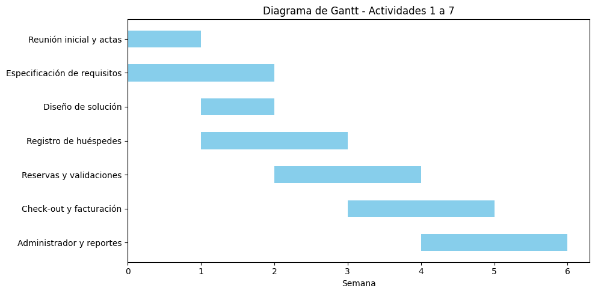

  <h1>Hotel Maison 33</h1>

  

## 1 - Integrantes

Jose Quiroga – Responsable del desarrollo de código

Laura Gelvez – Responsable de documentación

Alexis Vallejo – Responsable de pruebas y validaciones

## 2 - Vinculos Academicos y Descripcion

#### Jose Quiroga
- Soy estudiante de Ingenieria Industrial. Tengo conocimientos acerca de el lenguaje de programacion python, y distintos lenguajes usados en programas de optimizacion, por lo que principalmente buscare que el codigo sea ordenado, depurado y facil de entender, para que personas que incluso no saben programar puedan realizar lo que necesiten y cumplir con el objetivo del proyecto 

#### Laura Gelvez
- Soy estudiante de Ingeniería Industrial con poca experiencia en programación, pero con muchas ganas de aprender y crecer. Me esfuerzo por trabajar con excelencia, colaborar en equipo, aportar desde mis conocimientos y documentar de manera clara cada proceso.

#### Alexis Vallejo
- Soy estudiante de Ingeniería Industrial. He realizado la creación de unos códigos en mi carrera como instrumentista industrial, enfocados en la programación de Arduino y en la creación de un programa de gestion de mantenimiento, tengo conceptos básicos sobre programación en lenguaje C y C++. Al trabajo puedo aportar mi capacidad de manejo de información, responsabilidad y ganas de sacar el trabajo adelante.

## 3 - Descripcion 
Para cumplir correctamente con el proposito del codigo para el hotel de forma sencilla para que cualquier persona lo pueda entender, utilizaremos el lenguaje de programacion python junto a la libreria Matplotlib, para generar graficos faciles de reconocer y sea intuitivo a la hora de requerir los servicios el hotel 

## 4 - Licencia 
Este proyecto está bajo la licencia [ Trabajo-Algoritmia-y-Programacion-2025-1 © 2025 by Jose Quiroga is licensed under CC BY 4.0 ](https://creativecommons.org/licenses/by/4.0/).

## 5 - Reporte de vision 
Se realizará un código en el cual el hotel Maison 33 podrá tener un registro de todos sus clientes con los datos necesarios para brindar el mejor servicio, igualmente los clientes podrán realizar reservas acerca del servicio requieran y el tiempo que lo necesiten de una forma fácil y cómoda

## 6 - Especificaciones de requisitos
Para el correcto desarrollo del codigo se hara uso de diferentes componentes para asi crear la logica y desarrollar el programa.

#### • ¿Qué puede hacer el sistema? 
Puede registrar informacion importante y util sobre los huespedes podrá tener un registro de todos sus clientes con los datos necesarios para brindar el mejor servicio, ademas darle la facilidad al usuario de mostrar sus necesidades y buscar correctamente que es lo que quiere, conocer informacion acerca de,conocer cuando los clientes tienen los servicios y cuando dejen de necesitarlos, darle a entender al cliente las especifiones que debe tener en cuenta en el momento del uso del programa, dependiendo del servicio que necesite el cliente podra ver el valor de su estancia para conocer cuanto dinero usara, para los administrativos, ellos podran ver el repositorios de las habitaciones usadas y por usar, ademas de los usuarios registrados.

#### • ¿Qué se espera que haga bien? 
Los calculos correspondientes sobre el valor de cada servicio relacionados a las noches de uso del hotel para que el cliente tenga la informacion correcta, se guarde +correctamente la informacion brindada por cada usuario, ademas de que en la parte administrativa solo puedan entrar personas autorizadas usando autentifiacion 

#### • ¿Qué debe evitarse o no debe hacer? 
El programa debe evitar datos invalidos, o incompletos por parte de los usuarios, por lo que se tendran una especificaciones requeridas, tampoco se debe poder mostrar informacion de los administrativos a los usurios, ademas de no mostrar valores incorrectos a la hora de realizar la reserva

#### • ¿Qué librerías se requieren para llevar a cabo la solución? 
Usaremos la libreriua matplotlib para generar distintos graficos y asi facilitar la informacion que se requiera tanto para usuarios como para administrativos

#### • ¿Qué funciones se deben crear para resolver el problema planteado? 
Las funciones que usaremos principalmente en el codigo y nos ayudaran a llevar correctamente al usuario a lo que necesite serán:
def Realizar_Reserva (), def Registrar_Salida(), def Datos_Administrativos(), def Generar_Reportes, de Graficar_Datos(), 

#### • ¿Qué estructuras de datos se van a implementar en la solución? 
Las estructuras que usaremos para implementar en la solucion serian herramientas como:
Estructuras de control (if, else, while) 
colecciones (diccionarios, listas, tuplas).

## 7 - Plan de Proyecto
### Actividades - Tiempo estimado
Reunion inicial y actas de entendimiento - 2h

Analisis del problema y especificacion de requisitos - 3h

Diseño de la solucion - 3h

Programar modulo de registro de huespedes - 4h

Programar reservas - 4h

Programar check-out y facturacion - 4h

Programar modulo de administrador - 5h

Implementacion de graficos - 4h

Prueba del sistema y control - 4h

Redaccion del manual - 2h

Organizar repositorio - 1h

### Presupuesto del Proyecto 
Número de estudiantes: 3

Horas totales invertidas: 3 x 50 = 150 horas

Valor simbólico de práctica profesional: 1 SMLV (Salario Mínimo Legal Vigente)

Jose Quiroga – Responsable del desarrollo de código	65 horas

Alexis Vallejo – Responsable de pruebas y validaciones	25 horas

Laura Gelvez – Responsable de documentación	30 horas

Actividades grupales (reuniones, actas, revisión, sustentación)	Todos	30 horas

Total estimado: 150 horas

## 8 - Plan de versionado

| Versión | Fecha      | Cambios realizados                                                    | Responsable    |
| ------- | ---------- | --------------------------------------------------------------------- | -------------- |
| v0.1    | 2025-05-11 | Inicio del proyecto, lectura del enunciado oficial                    | Todo el grupo  |
| v0.2    | 2025-05-12 | Análisis de requisitos: funcionalidades, validaciones, estructuras    | Todo el grupo  |
| v0.3    | 2025-05-12 | Creacion de las actas de responsabilidades                            | Laura Gelvez   |
| v0.4    | 2025-05-13 | Descripcion de cada uno de los integrantes con sus funciones          | Todo el grupo  |
| v0.5    | 2025-05-14 | Descricpion del proyecto, junto con la vision del mismo               | Laura Gelvez   |
| v0.6    | 2025-05-14 | Implementacion de la licencia para el trabajo                         | Todo el grupo  |
| v0.7    | 2025-05-14 | Especificaciones de como sera el programa para el trabajo             | Todo el grupo  |
| v0.8    | 2025-05-14 | Plan del proyecto (Calendario)                                        | Laura Gelvez   |
| v1.0    | 2025-05-15 | Primera entrega del trabajo                                           | Todo el grupo  |
| v1.1    | 2025-05-17 | Diseño del menú principal e interfaz en consola                       | Jose Quiroga   |
| v1.2    | 2025-06-01 | Implementación de registro de huéspedes con validaciones              | Jose Quiroga   |
| v1.3    | 2025-06-07 | Función de realizar reservas y creación de archivos CSV               | Jose Quiroga   |
| v1.4    | 2025-06-15 | Implementación del módulo de check-out (registro de salida)           | Jose Quiroga   |
| v1.5    | 2025-06-22 | Facturación completa por tipo de habitación                           | Jose Quiroga   |
| v1.6    | 2025-06-30 | Creación del módulo administrativo con autenticación                  | Jose Quiroga   |
| v1.7    | 2025-07-10 | Agregada función de check-in (registro de ingreso)                    | Jose Quiroga   |
| v1.8    | 2025-07-13 | Validaciones mejoradas y estructura general del sistema refinada      | Alexis Vallejo |
| v1.9    | 2025-07-14 | Corrección de errores con archivos CSV y codificaciones               | Alexis Vallejo |
| v2.0    | 2025-07-15 | Versión final funcional. Incluye log de eventos, reportes y gráficos  | Alexis Vallejo |

## 9 - Algoritmo
https://github.com/JoseQuroga/Trabajo-Algoritmia-y-Programaci-n-2025-1-/blob/a2aea809403b0e52c85a54876336afaed03c4b98/src/Codigo

## 10 - Manual de Usuario 
https://github.com/JoseQuroga/Trabajo-Algoritmia-y-Programaci-n-2025-1-/blob/a2aea809403b0e52c85a54876336afaed03c4b98/doc/Manual_Usuario.md
